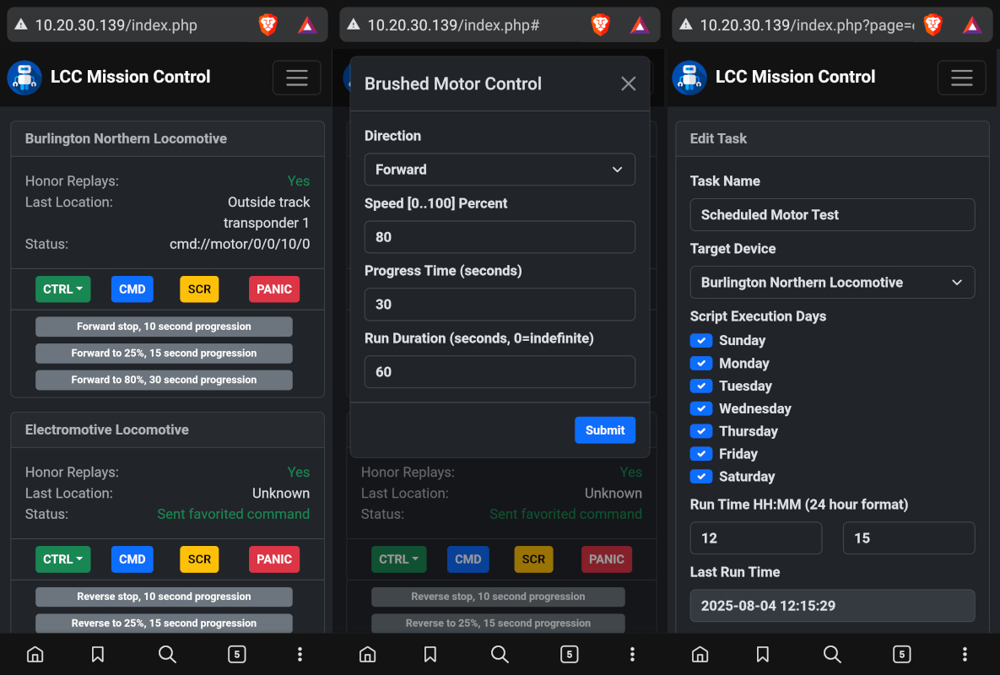

# LoRa+CMD+CTRL
**aka: LCC** - Remote command and control system based on Raspberry Pi (or clone), ESP32, and RYLR998 LoRa wireless modems. Can be used for any kind of automation that requires remote switching, motor direction and speed control, position/location tracking, and scripting/scheduling. Also works great for model railroad control.

You may contact me directly at https://panhandleponics.com 
Subscribe to the official YouTube channel at https://www.youtube.com/@PanhandlePonics

_**NOTE:** While this can be used as an alternative to DCC and WCC in the model railroad world, that absolutely is not my specialty. However, I do have a local hobbyist in that field that I'm working with in order to make this a viable alternative for that purpose, which is far more affordable than a DCC/WCC upgrade._

**This project began on July 1, 2025 and does not yet have an official release.**

---
 
---

LCC is a client & server system where a mission control web app runs on a Raspberry Pi _(or clone)_ or any other Debian Linux based PC/SBC. The communications backbone between the server and client devices is LoRa WAN wireless networking based on the Reyax RYLR998 modem.

LoRa WAN networking runs at a lower frequency than WiFi and Bluetooth, so it doesn't suffer from all of the noise and congestion that plagues the 2.4 GHz and 5 GHz ISM bands. This method also doesn't require a persistent connection between the client and server and only exchanges short text based messages.

Due to the lower frequency and near zero RF noise/congestion, this system works over incredibly long ranges with no additional infrastructure needed. For example, the mission control modem could be mounted on a rooftop and communicate with clients well over a mile away.

This system is intended for any personal application where remote control of motorized devices and remote switching is wanted without the need for WiFi infrastructure and where internet exposure is unwanted. Keep in mind that LoRa WAN only provides network password protection, communications are not encrypted.

The recommended LCC mission control server is an [Orange Pi Zero 3 1GB](https://www.amazon.com/dp/B0CB1BYTT8) running as a WiFi access point. You simply connect your phone or computer to this WiFi network, or connect the server's ethernet port to your home router if you need remote VPN access to it. Simple port forwarding into it is strongly discouraged!

### Use Cases
- Lighting/Fan/Pump automation
- Antenna and solar panel positioning
- Conveyor and gate automation
- Irrigation system automation
- Motorized seasonal decorations
- Model railroad automation

### Motor Control
The LCC receiver module can control standard DC brushed motors using a PWM driven H bridge driver such as an L298N, or stepper motors such as a Nema 17 with a DRV8825 driver. _(You may actually use any driver you like.)_ Motor control includes direction, speed, runtime, progression time to smooth speed changes, and the number of steps _(instead of duration and progression)_ if using a stepper motor.

### Position/Location Tracking
In the case of mobile LCC receivers such as those on a model train or conveyor bot, position and location detection is handled by way of IR LED transponders. These are basically an IR remote control transmitter that repeats the same number over and over. The LCC receiver phones home to mission control when these are detected to report its location and may perform actions based on the location.

### Remote Limit Sensing
The LCC receiver module uses two GPIO pins for limit sensing so that the motor will stop running in the current direction if its limit switch is triggered. These are common in linear actuators and motorized ball valves. The unit will phone home to mission control to report this status.

### Remote Switching
The LCC receiver module can be any variety of ESP32, the switching capabilities are only limited by the number of exposed GPIO pins. If you have a large number of switching needs per receiver, you may use an MCP23017 I2C 16 port GPIO expansion module.

### Remote MP3 Playback
Sound files (.mp3) can be stored on an SD card and played back as needed. These are useful for greetings, sound effects, warnings, etc. This requires a WWZMDiB _(DFRobot DFPlayer)_ sound module and speaker attached. Sound files can play as a single shot or in a continuous loop.

### Remote Neopixel/WS2812 RGB LED Control
Neopixel/WS2812 addressable LEDs can be controlled at the individual fixture/LED level or the entire network can change color at the same time. Power things with a decent [Mean Well](https://www.meanwell.com/) power supply and one LCC receiver module can run an entire Christmas light show. Lighting scenes and animations can be created using the [Lua](https://github.com/elua/elua) programming language.

### Scheduling
The LCC mission control server can schedule scripts to run at specific times on specific days. However, in the case of single board computers such as the Raspberry Pi _(or clones)_ this requires the addition of a real time clock module to be added if the mission control server is isolated from the internet.

### Scripting
LCC remote control commands and scripts are completely open ended and are easy to create. Scripts can contain up to 16 sequential commands and run as a single shot instance or may run repeatedly. Scripts can also call another script at the end of its run, which means you can actually string an endless number of commands together. _(LCC receiver modules have a cache that can hold 16 commands at a time.)_
